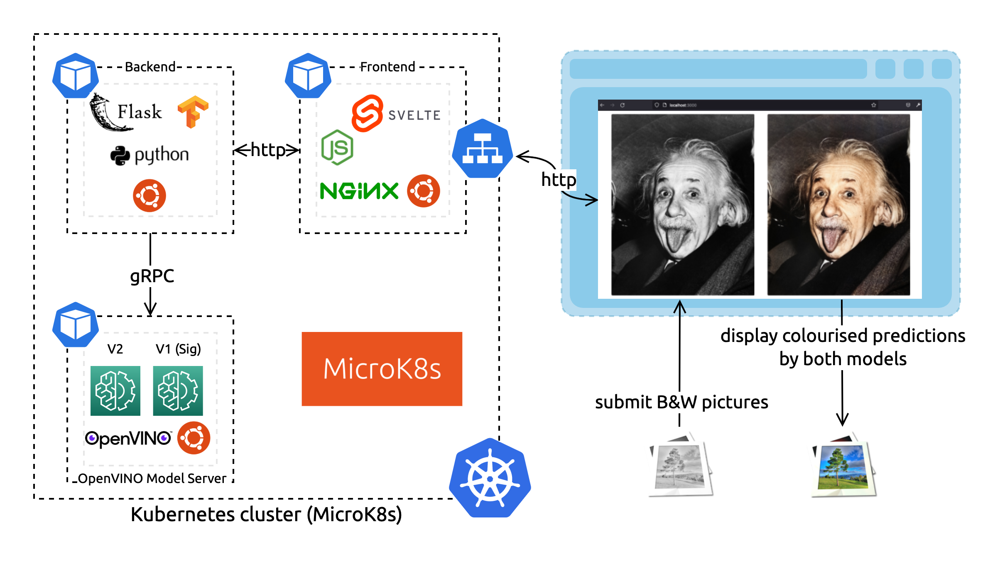

# Colourising black and white images with OpenVINO on Ubuntu demo
... [deployed](#Kubernetes-deployment) on MicroK8s!


The READMEs in this repository are aimed to be technical and help you get started quickly.    
For more stories and explanations, read the Ubuntu blog:
1. [Intel and Canonical to secure containers software supply chain](https://ubuntu.com/blog/secure-containers-supply-chain-intel-openvino-canonical) (Intro)
 2. [How to colourise black & white pictures: OpenVINO™ on Ubuntu containers demo (Part 1)](https://ubuntu.com/blog/how-to-colourise-black-white-pictures-openvino-containers-part-1) (Architecture)
<!-- 3. []() (How to) TODO: blog #2 -->

## Components 

Our architecture consists of three microservices: a backend, a frontend, and the OpenVINO Model Server to serve the neural network predictions. The Model Server component will serve two different demo neural networks to compare the results (V1 and V2). All these components use the Ubuntu base image for a consistent software ecosystem and containerised environment.



### Backend

Interface frontend <> OVMS
<!-- TODO -->

### Model Server

Serves the Colorization Model

You can try it alone running
```sh
# Build the image
docker build modelserver -t modelserver:latest
# Deploy locally with Docker
docker run --rm -it -p 8001:8001 -p 9001:9001 modelserver:latest --config_path /models_config.json --port 9001 --rest_port 8001
# The REST API is available at http://localhost:8001/
# read more on https://docs.openvino.ai/
```
<!-- TODO -->

### Front end

A sweet interface to try the demo colourisation neural networks!
<!-- TODO -->

## Kubernetes deployment

### Install MicroK8s (if you need a Kubernetes cluster in <5mn)

> You can skip this step if you already have a Kubernetes cluster at hand.

Setup [MicroK8s](https://microk8s.io/) to quickly get a Kubernetes cluster on your machine.

```sh
# https://microk8s.io/docs
sudo snap install microk8s --classic
# Add current user ($USER) to the microk8s group
sudo usermod -a -G microk8s $USER && sudo chown -f -R $USER ~/.kube
newgrp microk8s
# Enable the DNS, Storage, and Registry addons required later
microk8s enable dns storage registry
# Wait for the cluster to be in a Ready state
microk8s status --wait-ready
# Create an alias to enable the `kubectl` command
sudo snap alias microk8s.kubectl kubectl
```

### Build the components' OCI images

Every [component](#Components) comes with a `Dockerfile` to build itself in a  standard environment and ship with its deployment dependencies (read [What are containers](https://ubuntu.com/containers/what-are-containers)). All components build an Ubuntu-based docker image for a consistent developer experience.

Before being able to deploy all our microservices with Kubernetes to run our colouriser app, we need to build the images and upload them to a registry accessible from our Kubernetes cluster.

> It is expected that this step will take some time to complete as there are many container images and depencies to fetch in order to build and deploy the components. Make sure you're on a performant network (and not billed per data usage!).

#### Backend

```sh
docker build backend -t localhost:32000/backend:latest
docker push localhost:32000/backend:latest
```

#### Model Server for both neural nets

```sh
docker build modelserver -t localhost:32000/modelserver:latest
docker push localhost:32000/modelserver:latest
```

#### Frontend

```sh
docker build frontend -t localhost:32000/frontend:latest
docker push localhost:32000/frontend:latest
```

### Deploy with Kubernetes

Apply the deployments and services configuration files

```sh
kubectl apply -f k8s
```

After a few minutes, that's it! Access the application at http://localhost:30000/.

```sh
# Watch the application being deployed
$ watch kubectl get all
NAME                               READY   STATUS    RESTARTS   AGE
pod/modelserver-6fdcc8f5f7-czx4m   1/1     Running   0          3m44s
pod/frontend-7d59b8dbd6-fw5cm      1/1     Running   0          3m44s
pod/backend-86d49b7f89-g8lnd       1/1     Running   0          3m44s

NAME                  TYPE        CLUSTER-IP       EXTERNAL-IP   PORT(S)          AGE
service/kubernetes    ClusterIP   10.152.183.1     <none>        443/TCP          27m
service/backend       ClusterIP   10.152.183.156   <none>        5000/TCP         3m44s
service/frontend      NodePort    10.152.183.47    <none>        3000:30000/TCP   3m44s
service/modelserver   ClusterIP   10.152.183.219   <none>        9001/TCP         3m44s

NAME                          READY   UP-TO-DATE   AVAILABLE   AGE
deployment.apps/modelserver   1/1     1            1           3m44s
deployment.apps/frontend      1/1     1            1           3m44s
deployment.apps/backend       1/1     1            1           3m44s

NAME                                     DESIRED   CURRENT   READY   AGE
replicaset.apps/modelserver-6fdcc8f5f7   1         1         1       3m44s
replicaset.apps/frontend-7d59b8dbd6      1         1         1       3m44s
replicaset.apps/backend-86d49b7f89       1         1         1       3m44s
```

## Deploy with Docker Compose

To get started quickly, we also provided a `docker-compose.yaml` file.

```sh
# start the project
docker-compose up
# stop the project
docker-compose up
# clean up
docker-compose up --remove
```

If you make changes in the code, you'll need to specifically rebuild the updated components:

```sh
# rebuild components and deploy the changes
docker-compose up --build
# rebuild a specific component (needs deploy)
docker-compose build <component-name>
```

Access the frontend at http://localhost:8000/ and the backend at http://localhost:8080/.
